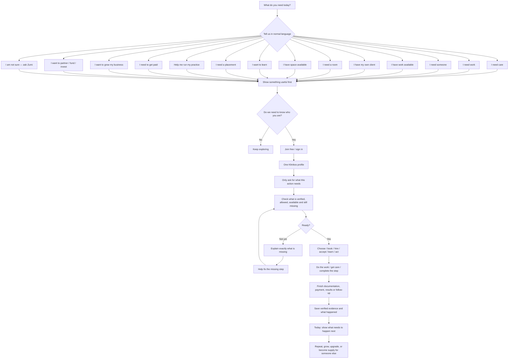
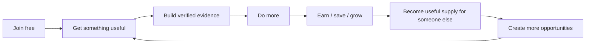

# Klinikos Action-First Living Universe — Frontend Experience Design

**Date:** 2026-09-01  
**Status:** Founder-approved design direction; written specification for review; implementation remains gated  
**Authority:** Subordinate to `docs/KLINIKOS_MASTER_CANON.md` and current verified runtime truth  
**Build relationship:** Refines and extends `docs/superpowers/specs/2026-08-31-klinikos-living-universe-entry-grid-design.md`; it does not create a sixth plane, a second identity system, a second Grid, or a second Zumi  
**Implementation coordination:** The person-first account/session foundation being integrated through PR #438 remains the backend authority for the first free-person identity tranche. This frontend design must consume that foundation rather than compete with it.

---

# 1. Purpose

Klinikos must feel like **one living healthcare environment**, not a collection of modules, dashboards, product pages, or separate applications.

The frontend permanently starts from ordinary human intent:

> **What do you need today?**

People should never need to know the internal names `Grid`, `EDU`, `Financial OS`, `Path`, `Plane`, `Eligibility Engine`, or `Clinical Opportunity Assembly` in order to use Klinikos.

They should be able to say things such as:

- **I need care.**
- **I need work.**
- **I have work available.**
- **I need someone tomorrow.**
- **I have my own client.**
- **I need a room.**
- **I have space available.**
- **I need supplies or equipment.**
- **I have equipment, capacity, or a service.**
- **I want to learn something.**
- **I need a placement or clinical hours.**
- **I can teach or take students.**
- **Help me run my practice today.**
- **I need to get paid.**
- **Why is this claim stuck?**
- **I want to start or grow my healthcare business.**
- **I want to partner with Klinikos.**
- **I want to invest, fund, or finance something.**
- **I am not sure — ask Zumi.**

Klinikos then assembles the relevant people, places, work, care, education, evidence, resources, authority, agreements, and money around the goal.

Permanent product law:

> **Users do not choose Klinikos modules. They tell Klinikos what they need, what they have, or what they are trying to become. Klinikos recomposes around that objective.**

---

# 2. Scope Classification

This is an **architectural frontend redesign**.

It changes how the whole system is projected without replacing the underlying domain authorities. It affects:

- public acquisition;
- free-person entry;
- one-person identity;
- Grid discovery and supply;
- professional profiles;
- patient discovery;
- clinic/practice operations;
- healthcare workforce;
- education and placements;
- room/equipment/capacity exchange;
- regulated clinical opportunity assembly;
- financial/billing workflows;
- enterprise and public-sector paths;
- investor/lender/partner discovery;
- Zumi placement and behavior;
- mobile composition;
- navigation and language;
- accessibility;
- conversion and monetization surfaces.

This design does **not** authorize implementation by itself. After founder review, a separate Superpowers implementation plan must decompose this architecture into mergeable waves.

---

# 3. Permanent Five-Plane Law

The frontend remains a projection of exactly five top-level planes:

1. **Healthcare Universe Plane** — who and what exists in healthcare.
2. **Economic & Resource Plane** — what can be needed, supplied, scheduled, rented, purchased, taught, worked, financed, or fulfilled.
3. **Lifecycle Plane** — what journey is happening now and what needs to happen next.
4. **Operating Infrastructure Plane** — identity, trust, clinical, Grid, EDU, financial, evidence, network, intelligence, security, integration, and policy engines.
5. **Compounding Business Plane** — how useful actions become revenue, retention, expansion, network effects, evidence, defensibility, and enterprise value.

The user does **not** browse these planes as five dashboards.

They are hidden structural lenses underneath one active objective.

Examples:

- `I NEED AN RN TOMORROW` touches Healthcare Universe + Resource + Lifecycle + Operating Infrastructure + Business Plane.
- `I HAVE MY OWN CLIENT` can touch professional identity + patient + clinic + prescriber + inventory + location + payment + evidence + reputation.
- `I NEED A CLINICAL PLACEMENT` can touch student + school + preceptor + site + competency evidence + schedule + Grid + employment progression.
- `WHY IS THIS CLAIM STUCK?` can touch visit evidence + coding + claim state + payer response + revenue exception + next action.

The experience remains one Klinikos.

---

# 4. Frontend Language Law

## 4.1 Primary rule

Use **everyday healthcare language first**.

Internal domain terms may appear in help, professional documentation, or technical administration when genuinely useful, but not as the first thing a person must understand.

### Internal concept → frontend language

| Internal concept | Primary frontend language |
| --- | --- |
| Person identity | **Your Klinikos profile** |
| Account | **Your account** |
| Role claim | **What do you do?** / **What are you here for?** |
| Verification | **Verified** / **We still need to verify this** |
| Eligibility | **What you need before you can do this** |
| Authority | **Who needs to approve this** / **Who is allowed to do this** |
| Organization membership | **Your workplaces / organizations** |
| Active organization context | **You are working as… at…** |
| Grid need | **I need…** |
| Grid supply | **I have…** |
| Grid | **Find / Offer / Network** in ordinary screens; `Grid` may remain a branded secondary term |
| Path | **Your next steps** |
| EDU | **Learn / Train / Practice / Placement** |
| Living Home | **Today** / **What needs to happen?** |
| Current Visit | **Today’s visit** |
| Financial OS | **Money / Billing / Get paid / Fix this payment problem** |
| Resource | **What you need** / **What you can offer** |
| Opportunity | **Work / Client / Booking / Placement / Request**, depending on context |
| Inspector | **Details** / context panel, usually unlabeled |
| ActionDock | **Next action** / persistent action area, usually unlabeled |
| ZumiCommandSurface | **Ask Zumi** |
| Requirement gate | **Before you can continue, we need…** |
| Blocked state | **You can see this, but you cannot book it yet because…** |
| Context switch | **Use Klinikos as: Me / [Organization] / [Approved role]** |

## 4.2 Tone

Frontend copy must be:

- short;
- conversational;
- direct;
- specific;
- non-judgmental;
- legally and clinically accurate without jargon dumping;
- written around the next action.

Bad:

> `Eligibility verification failed: malpracticeEvidence.status !== ACTIVE`.

Good:

> **You can see this opportunity, but you cannot accept it yet. We still need active malpractice coverage for this type of work.**

Bad:

> `Select resource class.`

Good:

> **What do you need?**

Bad:

> `Select organizational context.`

Good:

> **Who are you working as right now?**

---

# 5. One Living Front Door

## 5.1 Public hero

Primary public headline:

> **What do you need today?**

Primary input placeholder:

> **Tell Klinikos what you need…**

Secondary line:

> **Ask Zumi, search, or choose something below.**

Example rotating/public-safe prompts:

- `Find an oncologist that takes my insurance.`
- `I need an RN tomorrow.`
- `I am an RN looking for injector work.`
- `I have two treatment rooms open Friday.`
- `I need a clinical placement.`
- `I have my own client and need a place to work.`
- `My clinic keeps losing referrals.`
- `Why has this claim not been paid?`
- `I need a phlebotomist.`
- `I want to grow my healthcare business.`

Public visitors should get useful, public-safe discovery before being forced to register whenever policy permits.

The signup prompt appears when identity, saving, persistence, messaging, booking, verification, agreement, payment, restricted detail, or another governed action creates real user value.

Primary CTA:

> **Join free**

Permanent free-entry promise:

> **Join Klinikos free. Build one healthcare identity. Find what matters to you. Pay only when advanced tools, business services, governed transactions, or higher-cost capabilities justify it.**

---

# 6. Universal Action-First Flow



This is the core of every user journey.

---

# 7. One Person, Many Roles, One Identity

A person is not permanently a single persona.

One person may be:

- a patient;
- an RN;
- a student;
- an independent contractor;
- a parent/caregiver;
- a clinic owner;
- an employer;
- a preceptor;
- an investor;
- a vendor representative;
- a school instructor;
- more than one of these at the same time.

Klinikos therefore must never force users into duplicate accounts because their life changes.

Canonical lifecycle example:

```text
STUDENT
→ GRADUATE
→ LICENSED RN
→ FINDS SHIFTS
→ BUILDS VERIFIED EXPERIENCE
→ LEARNS AESTHETICS
→ BRINGS OWN CLIENTS
→ USES OTHER CLINICS / ROOMS
→ STARTS BUSINESS
→ OPENS PRACTICE
→ HIRES THROUGH KLINIKOS
→ HOSTS STUDENTS
→ BECOMES PRECEPTOR
→ BECOMES GRID SUPPLY FOR THE NEXT PERSON
```

Frontend language:

> **Use Klinikos as:**
> - Me
> - RN at Luxe Medi
> - Owner at My Practice
> - Preceptor

Changing context must change what the user can see and do, but it must never silently create authority.

---

# 8. Detailed Everyday Journeys

## 8.1 Patient / family / caregiver — `I need care`

### Frontend flow

```text
I NEED CARE
→ What do you need help with?
→ Where?
→ When?
→ What matters to you? [insurance / home or clinic / language / accessibility / preference]
→ Show real choices
→ Choose a person or place
→ "Before you book, we still need…" [only when required]
→ Book / request
→ Forms / consent / insurance / payment as needed
→ Get care
→ "Here is what happens next"
→ Result / referral / follow-up / balance / another appointment
```

Examples:

- primary care;
- dentistry;
- behavioral health;
- physical/occupational/speech therapy;
- pain management;
- orthopedics;
- imaging;
- laboratory/phlebotomy;
- aesthetics;
- urgent/ambulatory care;
- home/mobile services where legally supported;
- other approved healthcare services.

Patient privacy remains private. Patients do not become public professional Grid profiles.

## 8.2 Healthcare professional — `I need work`

```text
I NEED WORK
→ What kind of work do you want?
→ Where can you work?
→ When are you available?
→ Build one profile from license / education / experience / skills / insurance / availability
→ Show only work you can legitimately pursue
→ If something is missing: "You can see this, but you need ___ before you can accept it"
→ Apply / accept / interview / book
→ Work
→ Complete required evidence
→ Get paid through the appropriate relationship
→ Verified experience grows
→ Better work / clients / training / business opportunities become relevant
```

Possible opportunity types:

- jobs;
- shifts;
- per-diem coverage;
- independent contracts;
- consulting;
- temporary coverage;
- remote work;
- administrative/revenue-cycle work;
- teaching/precepting;
- approved direct-client opportunities;
- business-building opportunities.

## 8.3 Professional with own client — `I have my own client`

This is the canonical **governed clinical opportunity assembly** journey.

The user never sees that internal phrase unless they ask what Klinikos is doing.

Frontend flow:

```text
I HAVE MY OWN CLIENT
→ What does your client need?
→ When?
→ Where?
→ "What do you already have?"
   [client / skill / license / insurance / product / room / equipment]
→ Klinikos checks what is still required
→ "Here is what is missing before this can happen"
   [clinical evaluation / order / prescriber / practice / room / inventory / emergency readiness / agreement]
→ Show eligible ways to complete the missing pieces
→ Choose the arrangement
→ Patient completes required clinical steps
→ Product/resource is allocated through the proper clinical/business rail
→ Professional performs the authorized service
→ Documentation is completed
→ Money is separated by what each party actually provided
→ Follow-up / complication ownership stays explicit
→ Verified work and relationship evidence returns to the professional profile
```

Permanent rule:

> **Klinikos may assemble the people, authority, location, resources, evidence, agreements, and money around a healthcare need. It may not make a prohibited clinical action lawful merely because somebody paid, subscribed, trained, or has a high rating.**

### Regulated inventory rule

Prescription drugs, prescription devices, and other regulated clinical inventory are **not ordinary public marketplace goods**.

Frontend should say:

> **Available for this approved treatment**

rather than:

> `Buy Botox`

when the legal/clinical relationship requires patient-specific authorization or another controlled path.

## 8.4 Practice / clinic — `Help me run my practice today`

Opening screen asks:

> **What needs to happen today?**

Then shows only real work such as:

- patients arriving;
- staff coverage;
- messages requiring action;
- referrals still open;
- results needing review;
- prior authorizations;
- incomplete documentation;
- billing blockers;
- claims/issues;
- balances/payments;
- rooms/capacity sitting unused;
- opportunities for Grid staffing or resource supply;
- tasks that need an owner.

Canonical flow:

```text
TODAY
→ What is unfinished?
→ Who owns it?
→ What is blocking it?
→ What can Zumi prepare or explain?
→ What must a person approve?
→ Finish the action
→ Carry the result forward automatically
→ Show the next unfinished thing
```

No separate dashboard should be required merely because the same patient/work item touches scheduling, clinical, referral, billing, or follow-up state.

## 8.5 Practice/employer — `I need someone`

```text
I NEED SOMEONE
→ "Who do you need?"
→ "What do they need to be able to do?"
→ Where?
→ When?
→ Employment / shift / contractor / coverage relationship
→ Klinikos converts the plain-language request into governed requirements
→ Eligibility before ranking
→ Show best eligible choices
→ Explain missing requirement when someone is visible but blocked
→ Invite / interview / hire / book
→ Agreements / credential evidence / schedule
→ Work happens
→ Completion / reputation / repeat relationship
```

## 8.6 Practice/employer — `I have work available`

Frontend examples:

- `I need an RN tomorrow.`
- `I need front-desk coverage Friday.`
- `I need a medical biller.`
- `I need an injector Saturdays.`
- `I need a preceptor.`

The user should never need to build a complicated job-posting schema before they can state the need.

Zumi may help structure the post, but server policy owns requirements and eligibility.

## 8.7 Room / chair / clinic / facility owner — `I have space available`

```text
I HAVE SPACE AVAILABLE
→ What is available? [room / chair / office / classroom / procedure space / other]
→ Where?
→ When?
→ What can the space support?
→ What rules/equipment/insurance/access apply?
→ Publish eligible availability
→ Match real demand
→ Review requester
→ Agreement / payment / access
→ Use the space
→ Completion / evidence / repeat booking
```

This is a core unused-capacity monetization path.

## 8.8 Professional / organization — `I need a room`

```text
I NEED A ROOM
→ What are you doing there?
→ Where?
→ When?
→ What must the room have?
→ Check whether the activity is allowed there
→ Show eligible space
→ Book / request
→ Agreement / payment / access
→ Complete activity
```

Location is not a decorative map pin. It can be part of clinical/legal eligibility.

## 8.9 Equipment / service / capacity provider — `I have something healthcare needs`

Possible categories:

- equipment;
- diagnostic capacity;
- laboratory capacity;
- imaging capacity;
- transportation;
- interpretation;
- DME-related resources where lawful;
- staffing services;
- billing/revenue-cycle services;
- implementation services;
- technology;
- professional consulting;
- approved business services;
- classroom/training capacity;
- other governed resource classes.

Flow:

```text
I HAVE SOMETHING HEALTHCARE NEEDS
→ What is it?
→ Who can use it?
→ Where / when is it available?
→ What proof / agreement / regulatory condition applies?
→ Publish to the relevant audience
→ Match demand
→ Complete booking / service / integration / relationship
→ Track outcome
```

## 8.10 Student / learner — `I want to learn`

```text
I WANT TO LEARN
→ What do you want to be able to do next?
→ What do you already know / have?
→ Show the relevant learning path
→ Learn
→ Practice
→ Assessment / human review where required
→ Build evidence
→ "Here is your next step"
   [placement / preceptor / job / more training / Grid opportunity]
```

Education evidence never becomes a professional license by itself.

## 8.11 Student — `I need a placement or clinical hours`

```text
I NEED A PLACEMENT
→ What program are you in?
→ What kind of hours / experience do you need?
→ Where and when can you attend?
→ What documents / approvals are required?
→ Find eligible preceptors / sites
→ Request
→ School / site / student approvals
→ Schedule
→ Complete hours
→ Evidence returns to school + student profile
→ Qualified experience can support later work discovery
```

## 8.12 School / program / preceptor — `I can teach or take students`

```text
I CAN TAKE STUDENTS
→ What can you teach / supervise?
→ What credentials / site requirements matter?
→ When / where?
→ Show relevant schools / learners / cohorts
→ Approve placement
→ Track attendance / evidence / competency
→ Complete program requirement
→ Repeat relationship / future workforce connection
```

## 8.13 Money / billing — `I need to get paid`

User language examples:

- `Why is this claim stuck?`
- `This visit is not ready to bill.`
- `Where is my payment?`
- `Why does this balance not match?`
- `What is stopping this claim?`

Flow:

```text
I NEED TO GET PAID
→ Start with the real event / visit / service / claim / invoice
→ Show what happened so far
→ Show the real blocker
→ "Here is what needs to happen next"
→ Prepare the allowed fix
→ Human approves where required
→ Send / reconcile / follow up
→ Mark complete only from real evidence
```

Internal financial state remains precise:

`PERFORMED → DOCUMENTED → CODE SUPPORTED → CHARGE EXPECTED → CLAIM READY → SENT → ADJUDICATED → PAID → RECONCILED`

The frontend translates that into ordinary sentences.

## 8.14 Professional — `I want to start or grow my healthcare business`

```text
I WANT TO GROW MY BUSINESS
→ Where are you now? [student / professional / contractor / owner]
→ What are you trying to become?
→ Use the identity, experience, customers, relationships and evidence already in Klinikos
→ Show what is missing
   [entity / insurance / space / staff / technology / training / supplies / financing / customers / operational systems]
→ Connect governed resources and partners
→ Launch / grow
→ Hire / host / teach / offer space / provide services
→ Become supply for the next person
```

Klinikos supports entrepreneurship without pretending to replace legal, tax, clinical, insurance, regulatory, or professional authority.

## 8.15 Payer / financial / administrative organization

Frontend intent examples:

- `I need information to finish this authorization.`
- `I need this claim corrected.`
- `I need to reconcile this payment.`
- `I need to understand what is missing.`

The same object/workflow should show the minimum-necessary information authorized for that party.

## 8.16 Lab / imaging / pharmacy / external healthcare rail

These organizations participate as authoritative external rails where appropriate.

Frontend intent examples:

- `I have appointment capacity.`
- `I need an order.`
- `I need to send a result.`
- `I need to receive a prescription/order request.`
- `This result is ready.`
- `This order cannot be completed because…`

Klinikos owns the workflow experience and state continuity where appropriate; it does not pretend to replace an authoritative external clinical rail when that would be unsafe, illegal, or economically irrational.

## 8.17 Government / workforce / community program

Intent examples:

- `I need to train 500 people.`
- `I need to connect graduates to work.`
- `I need to see program completion.`
- `I need qualified healthcare capacity in this region.`

Flow:

```text
PROGRAM GOAL
→ Define population / outcome / rules
→ Invite / enroll / discover eligible people or organizations
→ Deliver training / opportunity / resource coordination
→ Evidence and completion
→ Outcome reporting
→ Ongoing workforce / Grid / employer connection where authorized
```

## 8.18 Investor / lender / funder / strategic partner

Public-safe flow:

```text
I WANT TO FUND / INVEST / PARTNER
→ What are you evaluating?
→ Show the appropriate approved company/project/opportunity view
→ Public information first
→ Deeper diligence only when the relationship justifies it
→ Economics / milestones / use of funds / risks / evidence
→ Appropriate external investment / lending / grant / procurement process
→ Approved progress reporting
```

Never expose crown-jewel implementation merely because someone expresses investment interest.

---

# 9. The Healthcare Capacity Market

Grid must be understood as a **healthcare capacity and opportunity network**, not a job board.

Representative need/have pairs:

| Someone says | Klinikos can eventually connect |
| --- | --- |
| `I need an RN tomorrow` | eligible professional availability |
| `I have Friday open` | relevant work demand |
| `I need a treatment room` | eligible unused clinical/business space |
| `I have two rooms empty` | appropriate professional/organization demand |
| `I need a phlebotomist` | qualified professional supply |
| `I need a clinical placement` | school/preceptor/site capacity |
| `I can take two students` | learner/program demand |
| `I need imaging this week` | available imaging capacity and authorized workflow |
| `I have diagnostic capacity` | authorized demand |
| `I need billing help` | qualified revenue-cycle service supply |
| `I need a translator` | eligible interpretation resources |
| `I need transportation` | relevant transportation resources |
| `I need equipment` | approved equipment/resource supply |
| `I have my own client` | missing clinical/business infrastructure |
| `I want to open a practice` | space, staffing, systems, services, financing, education, demand |

Grid success is measured by **useful fulfillment and repeat relationships**, not listing count.

---

# 10. Clinical Opportunity Assembly

## 10.1 Purpose

A qualified professional may already have:

- skills;
- a license;
- malpractice coverage;
- customers;
- availability;
- entrepreneurial ambition;

but lack:

- prescribing/ordering authority;
- a medical-practice relationship;
- a room;
- regulated inventory;
- equipment;
- emergency readiness;
- business systems;
- compliant payment structure;
- follow-up infrastructure.

Klinikos should help assemble missing pieces **without representing that the professional may independently perform something they are not legally authorized to do**.

## 10.2 Internal policy stack

Every regulated opportunity can require checks across:

```text
PERSON
+ SERVICE
+ AUTHORITY
+ LOCATION
+ PRODUCT / INVENTORY
+ PATIENT
+ AGREEMENT
+ INSURANCE
+ MONEY
+ FOLLOW-UP
+ JURISDICTION
```

Frontend should not dump this as a legal checklist unless the user asks for details.

It should say:

> **You are almost ready. Before this appointment can happen, we still need:**
> - the patient’s required clinical evaluation/order;
> - an approved location;
> - the required product allocation.

Then show the legitimate ways to complete those steps.

## 10.3 Product/inventory presentation

Ordinary goods may use ordinary commerce UX where lawful.

Regulated clinical inventory uses controlled workflow language:

- **Available for this treatment**
- **Reserved for this patient/appointment**
- **Provided by [authorized organization]**
- **Requires clinical approval first**

Avoid public e-commerce language when the item is not legally an ordinary retail product for that user.

## 10.4 Mobile/home

`At home` is a policy-controlled service location, not a generic address option.

Frontend can offer:

> **Where do you want the service?**
> - At a clinic
> - At an approved location
> - At home, if available for this service in your area

The option becomes actionable only when jurisdiction + profession + service + organization + clinical policy support it.

---

# 11. Money and Monetization UX

Klinikos should monetize each legitimate layer it actually provides rather than forcing one percentage fee onto every healthcare transaction.

Potential frontend-visible money surfaces include:

- free individual identity/network participation;
- professional premium tools;
- organization subscriptions;
- clinic operations;
- implementation;
- premium Zumi/intelligence;
- credential/evidence tools;
- education/program fees;
- room/equipment/business-resource transactions where lawful;
- enterprise contracts;
- business services;
- financial/revenue-cycle tooling;
- payment technology/service fees where lawful;
- category-specific transaction economics only where legally cleared.

The frontend can still provide one simple checkout experience while the backend separates:

```text
PRODUCT / INVENTORY OBLIGATION
+ PROFESSIONAL SERVICE OBLIGATION
+ FACILITY / ROOM OBLIGATION
+ PLATFORM / SOFTWARE OBLIGATION
+ OTHER APPROVED SERVICE OBLIGATION
```

No raw `Klinikos takes X% of every medical professional fee` law should be embedded globally.

Fee logic must be resource-class- and jurisdiction-specific.

---

# 12. Zumi Placement Law

Zumi is not a chatbot destination.

Zumi is present beside important work.

Examples:

### Patient
> **“I am confused about what happens next.”**

Zumi explains the next step from authorized state.

### Professional
> **“What am I missing before I can accept this?”**

Zumi explains verified/required gaps.

### Clinic owner
> **“What is most likely to cause a problem today?”**

Zumi summarizes unfinished work and prepares actions.

### Student
> **“What do I need before I can apply for this placement?”**

Zumi explains requirements and relevant evidence.

### Billing
> **“Why is this claim stuck?”**

Zumi explains the evidence/state and proposes next work.

### Grid
> **“Find me an RN tomorrow who can actually do this.”**

Zumi interprets intent; eligibility and authority remain server-policy decisions.

Permanent law:

> **Zumi interprets, explains, prepares, recommends, and recomposes. It does not silently grant authority, verification, eligibility, payment truth, clinical truth, or organization access.**

---

# 13. Navigation Model

## 13.1 Public

Keep global navigation minimal:

- **Search / Ask Zumi**
- **How Klinikos helps**
- **Join free**
- **Sign in**

Do not lead with a product catalog.

## 13.2 Authenticated individual

Primary shell:

- **Today**
- **Find**
- **My activity**
- **Messages**
- **Profile**
- persistent **Ask Zumi**

## 13.3 Organization context

Context switch:

> **Use Klinikos as: Me / [Organization]**

When working as an organization, the Object Stage can project relevant areas such as:

- today’s work;
- patients/care where authorized;
- people/staff;
- schedule;
- referrals/results;
- money;
- Grid demand/supply;
- students/education;
- organization settings.

These are projections of the active organization objective, not independent applications the user must mentally stitch together.

---

# 14. Living Home — `Today`

Living Home is the place where Klinikos answers:

> **What needs to happen?**

It should not be a metric dashboard by default.

Priority stack:

1. things that require action now;
2. things blocked and why;
3. things waiting on someone else;
4. upcoming work;
5. useful opportunities;
6. learning/progression relevant to the person;
7. money needing attention;
8. messages requiring action;
9. suggestions from Zumi clearly labeled as suggestions.

A new free account should not see fake activity.

It can see real onboarding actions such as:

- **Finish your profile**
- **Tell Klinikos what kind of work you want**
- **Add your availability**
- **Verify your license when you are ready to use it**
- **Find your first opportunity**
- **Explore learning relevant to your goal**

---

# 15. Spatial / Map Experience

Map is a core projection when geography materially affects the decision.

Use it for:

- providers/places;
- shifts/work;
- room/capacity;
- placements;
- diagnostic capacity;
- approved mobile/service areas;
- resources whose location matters.

Map law:

- no invented coordinates;
- no hidden location collection;
- public-safe pins only;
- exact distance only when valid coordinates exist;
- location permission is explicit;
- list and map stay synchronized;
- every consequential map fact/action has a non-map equivalent;
- mobile may default to results first with explicit map switching.

The map is **not** the Grid itself. It is one view of relevant Grid/Universe state.

---

# 16. Profile / Healthcare Identity

The profile should feel like a healthcare-specific lifelong professional/network identity rather than an application form.

Sections appear progressively:

- **About you**
- **What you do**
- **Where you work**
- **Where you can work**
- **When you are available**
- **Education**
- **Licenses and credentials**
- **Insurance / required coverage**
- **Skills and services**
- **Experience**
- **What you are looking for**
- **What you can offer**
- **Verified activity / evidence**
- **Organizations and relationships**

Every fact carries provenance/state internally.

Frontend clearly distinguishes:

- **You added this**
- **Verified**
- **Expired / needs renewal**
- **Waiting for verification**

A resume may help populate the profile, but a resume is not treated as verified professional authority.

---

# 17. Trust, Reputation, and Evidence

Do not build ordinary star-rating culture as the only trust system.

Trust should increasingly use:

- verified identity;
- active license/credential evidence where applicable;
- verified completed relationships;
- completion/reliability evidence;
- appropriate organization verification;
- training/education evidence clearly separated from licensure;
- repeat relationships;
- context-specific reviews where lawful and useful.

Permanent law:

> **Reputation can reorder eligible choices. Reputation cannot make an ineligible person eligible.**

Frontend examples:

- **Verified RN license**
- **12 completed shifts through Klinikos**
- **Worked with this organization before**
- **Malpractice coverage needs renewal**
- **Training completed — professional authorization still required**

---

# 18. UI Composition

Primary visual direction:

- warm ivory / white dominant surfaces;
- black/obsidian typography;
- restrained oxblood/rose accents;
- generous whitespace;
- map/spatial views when location matters;
- sheets, drawers, inspectors, timelines, and persistent action surfaces;
- cards only when the object is naturally a card;
- avoid endless bento-box dashboards;
- dark/obsidian modes reserved for focused clinical/command/high-attention contexts rather than the whole application.

Desktop composition:

```text
CONTEXT RAIL | OBJECT STAGE | DETAILS / INSPECTOR
                     ↓
              PERSISTENT NEXT ACTION
                     ↓
                  ASK ZUMI
```

Mobile recomposes:

```text
OBJECT / RESULT
→ NEXT ACTION
→ DETAILS DRAWER
→ ASK ZUMI
```

Never merely crop the desktop shell.

---

# 19. Core Frontend Components / Reuse Targets

Reuse/extend existing foundations where present.

## Existing approved primitives to reuse

- `UniverseShell`
- `ObjectStage`
- `PlaneLens`
- `PathConstellation`
- `NarrativeTimeline`
- `Inspector`
- `SpatialView`
- `ZumiCommandSurface`
- `ActionDock`
- `PublicLivingGateway`
- `GridLiveMap`
- existing MapLibre/OpenFreeMap integration
- `screen-experience-contracts.ts`
- existing Living Home server state
- `/api/paths`
- existing Grid demand/resource/eligibility engines
- existing EDU readiness/evidence paths
- existing clinic/session authority during transition
- PR #438 person-first `Account`, `AccountCredential`, `AccountSession`, `LegacyUserAccountLink`, and `AccountEvent` foundation once merged/current

## New frontend projections likely required

Names are design-level, not implementation mandates:

- `IntentComposer` — “Tell Klinikos what you need”
- `QuickIntentActions` — everyday intent chips
- `DiscoveryStage` — list/map/context results
- `JoinFreeSheet` — progressive identity entry
- `ProfileProgress` — basic → verified as needed
- `RequirementChecklist` — “Before you can continue…”
- `OpportunityAssemblerView` — client/work/resource assembly without exposing policy internals
- `ContextSwitcher` — Me / organization / approved role
- `RelationshipEvidenceView` — verified activity/relationship history
- `MoneyTraceView` — “what happened to this money/claim?”

Implementation must first search for equivalent components and extend/reuse before building new.

---

# 20. Server / Client Boundary

Permanent boundary:

```text
DATABASE / DOMAIN ENGINES
→ SERVER IDENTITY + POLICY + AUTHORITY
→ MINIMUM-NECESSARY PRESENTATION CONTRACT
→ ACTION-FIRST LIVING UNIVERSE
→ USER CHOICE
→ SERVER REVALIDATION
→ AGREEMENT / PAYMENT / CLINICAL / BUSINESS ACTION
→ AUDIT + EVIDENCE + NEXT STATE
```

Keep server-side:

- proprietary ranking;
- eligibility logic;
- authority logic;
- jurisdiction policy;
- regulated resource rules;
- pricing rules not required in browser;
- risk logic;
- hidden orchestration;
- secrets;
- raw ORM/data internals.

Frontend receives:

- what the user may see;
- why something is relevant;
- whether it is actionable;
- what is missing;
- the next permitted actions;
- minimum evidence necessary to understand the decision.

---

# 21. Error / Blocked-State Language

Klinikos should explain rather than dead-end.

### Missing verification

> **You can save this opportunity now. Before you can accept it, we need to verify your RN license.**

### Missing insurance

> **You meet the other requirements, but active malpractice coverage is still required for this work.**

### Wrong organization context

> **You are currently using Klinikos as yourself. Switch to Luxe Medi to open this clinic record.**

### No location permission

> **We can still show results by city. Share your location only if you want distance-based results.**

### Regulated product

> **This product becomes available only after the required clinical approval for this patient.**

### No results

> **Nothing available matches all of your requirements yet. Save this need and Klinikos can show it when eligible supply appears.**

### Zumi uncertainty

> **I can help organize this, but I cannot verify that fact from the information Klinikos has yet.**

---

# 22. Conversion Without Destroying Network Growth

Individuals generally enter free.

The system should first create useful network participation and later surface paid capability when the person reaches a real higher-value need.

Examples:

### Free professional

- identity;
- basic profile;
- public-safe discovery;
- ordinary availability;
- relevant learning/path discovery;
- save opportunities;
- limited messaging/action where policy permits.

### Premium professional

Potential value:

- advanced availability/business tools;
- premium Zumi;
- business analytics;
- customer-management tools;
- deeper professional evidence;
- advanced booking/operations;
- business-launch features.

### Organization

Paid value can include:

- clinic/practice operations;
- staff/workforce tools;
- implementation;
- financial/revenue-cycle tools;
- enterprise governance;
- integrations;
- premium Grid demand/supply tools;
- EDU/institutional programs;
- intelligence/automation.

Frontend upgrade copy must name the benefit, not merely say `Upgrade to Pro`.

Example:

> **You are managing repeat clients now. Add business scheduling, customer follow-up, and income tracking.**

---

# 23. Network Compounding Loop



Examples:

### Student flywheel

```text
LEARN
→ PLACEMENT
→ VERIFIED EXPERIENCE
→ FIRST WORK
→ MORE WORK
→ INDEPENDENT CAREER
→ BUSINESS OWNER
→ EMPLOYER
→ PRECEPTOR
→ CREATES NEXT PLACEMENT
```

### Clinic flywheel

```text
USE KLINIKOS
→ FINISH WORK BETTER
→ FIND STAFF
→ FILL UNUSED SPACE
→ HOST STUDENTS
→ CONNECT SERVICES
→ EARN / SAVE / GROW
→ CREATE MORE GRID DEMAND + SUPPLY
```

### Patient flywheel

```text
FIND CARE
→ COMPLETE CARE JOURNEY
→ FOLLOW UP
→ RETURN WHEN NEEDED
→ TRUST VERIFIED RELATIONSHIPS
→ USE THE NETWORK AGAIN
```

---

# 24. Accessibility and Mobile Law

Required:

- keyboard operation;
- visible focus;
- semantic controls;
- screen-reader labels/landmarks;
- no hover-only required action;
- consequential touch targets at least 44px;
- readable at 200% zoom;
- reduced-motion support;
- mobile details as drawers/sheets;
- no hidden clinical/authority evidence solely to save space;
- map information duplicated in usable list form;
- plain-language validation.

---

# 25. Analytics and Success Measures

Do not judge this redesign by page views or number of components.

Measure:

## Public acquisition

- useful searches/intent sessions;
- percentage receiving a useful first result;
- join-free conversion after value;
- source → first useful action.

## Identity/network

- completed basic profiles;
- verified credentials where required;
- active availability;
- legitimate needs/haves created;
- return rate.

## Grid

- eligible demand;
- eligible supply;
- time to useful match;
- fulfillment;
- repeat fulfillment;
- blocked-state resolution;
- saved need → eventual supply match.

## EDU

- enrollment;
- completion;
- placement;
- evidence reviewed;
- work opportunity progression.

## Clinic

- unfinished work resolved;
- time to first value;
- cycle time;
- customer economic outcome evidence;
- unused capacity converted to legitimate supply.

## Money

- documented/billing blocker resolution;
- claim/reconciliation cycle time;
- verified collected revenue where authoritative financial evidence exists.

## Company

- free → paid conversion when value justifies it;
- retention;
- expansion;
- contribution margin;
- network effects;
- enterprise readiness;
- support burden.

---

# 26. Explicit Non-Goals

This design does **not**:

- create a sixth plane;
- create a public pharmaceutical marketplace;
- make Grid a staffing-only application;
- turn patients into public professional profiles;
- make education equal professional licensure;
- let reputation override eligibility;
- let payment create authority;
- let Zumi prescribe, authorize, verify, sign, or grant access by itself;
- promise zero liability to a physician, practice, professional, or Klinikos;
- globally take a percentage of professional medical fees without category/jurisdiction approval;
- replace authoritative pharmacy/lab/imaging/payer rails where inappropriate;
- invent map coordinates, ratings, customers, inventory, availability, outcomes, revenue, or integrations;
- expose proprietary ranking, policy, clinical, security, or orchestration mechanics in the browser;
- rewrite Current Visit as part of the first frontend tranche;
- bypass current clinic authority during the person-first auth transition;
- fabricate an organization for a free individual account.

---

# 27. Required Acceptance Tests

The implementation plan must produce RED → GREEN coverage for at least the following.

## Public/action-first

- public user can enter ordinary intent without selecting a module;
- public-safe useful result can appear before signup where permitted;
- signup occurs only when persistence/action/restricted detail requires identity;
- unsafe clinical/private text is not persisted through public-intent continuity.

## One identity / contexts

- free Person exists without fake organization;
- existing clinic login remains valid;
- a person can later acquire multiple legitimate organization/role contexts;
- switching context does not create new authority;
- restricted organization routes reject person-only context.

## Everyday language

- primary flows use approved ordinary-language labels;
- blocked states explain the actual missing requirement;
- no required action depends on understanding internal plane/module terminology.

## Grid

- need/have intent routes to existing Grid domain authority;
- eligibility precedes ranking;
- reputation cannot create eligibility;
- no price appears for a no-money transaction class;
- regulated inventory is not rendered as ordinary public e-commerce when controlled policy applies;
- patients remain private.

## Clinical opportunity assembly

- professional may bring a client without gaining unsupported prescribing/clinical authority;
- missing clinical authority/location/product/insurance requirements are surfaced as requirements;
- action remains blocked until server authority says ready;
- home/mobile is disabled when jurisdiction/service policy does not support it;
- one checkout may represent separate obligations without flattening them into one prohibited fee-share rule.

## EDU

- training evidence stays distinct from license/authority;
- placement workflow maintains school/student/site requirements;
- completed evidence can enrich the person profile without becoming self-verified credential truth.

## Clinic

- Today uses real unfinished work only;
- no fake metrics for new/empty organizations;
- Zumi prepares/recommends but cannot sign or authorize;
- Current Visit authority remains intact.

## Money

- frontend can explain actual financial state without inventing payment truth;
- claim/billing action is revalidated server-side;
- booked/collected/paid/reconciled states stay distinct.

## Accessibility/mobile

- keyboard + screen reader + visible focus;
- 44px consequential touch targets;
- reduced motion;
- 200% zoom;
- non-map equivalent;
- responsive recomposition rather than cropped desktop.

---

# 28. Implementation Decomposition Boundary

After founder approval of this written spec, invoke the Superpowers `writing-plans` workflow.

The implementation plan should be decomposed into independently mergeable waves rather than one giant frontend rewrite.

Expected decomposition direction:

1. **Wave 0 — reconcile with current main and PR #438**
2. **Wave 1 — action-first public gateway language + intent composer**
3. **Wave 2 — join-free continuity using person-first identity foundation**
4. **Wave 3 — unified profile / context switch projection**
5. **Wave 4 — Grid discovery/action-first results + native map/list convergence**
6. **Wave 5 — professional work / client / room / resource flows**
7. **Wave 6 — Living Home / Today object-stage convergence**
8. **Wave 7 — EDU / placement / preceptor convergence**
9. **Wave 8 — money/billing plain-language projection**
10. **Wave 9 — clinic/practice conversion and unused-capacity supply**
11. **Wave 10 — investor/lender/partner/public-sector controlled views**
12. **Wave 11 — full mobile/accessibility/browser acceptance + deployment verification**

Exact files and task order belong in the implementation plan after fresh `main` inspection.

---

# 29. Final Product Contract

Klinikos should increasingly feel like this:

```text
TELL KLINIKOS WHAT YOU NEED
→ SEE SOMETHING USEFUL
→ JOIN FREE WHEN IDENTITY ACTUALLY HELPS
→ BUILD ONE HEALTHCARE PROFILE
→ VERIFY ONLY WHAT THE NEXT ACTION REQUIRES
→ SEE PEOPLE / PLACES / WORK / CARE / LEARNING / RESOURCES THAT ACTUALLY FIT
→ UNDERSTAND WHAT IS MISSING
→ COMPLETE THE MISSING STEP
→ BOOK / HIRE / ACCEPT / LEARN / WORK / GET CARE / GET PAID
→ SAVE WHAT ACTUALLY HAPPENED
→ SEE WHAT NEEDS TO HAPPEN NEXT
→ GROW INTO THE NEXT ROLE WITHOUT STARTING OVER
```

The permanent design standard is:

> **Simple above. Powerful below. The complexity belongs to Klinikos, not to the person using Klinikos.**

And the permanent frontend question is:

> **What do you need today?**
